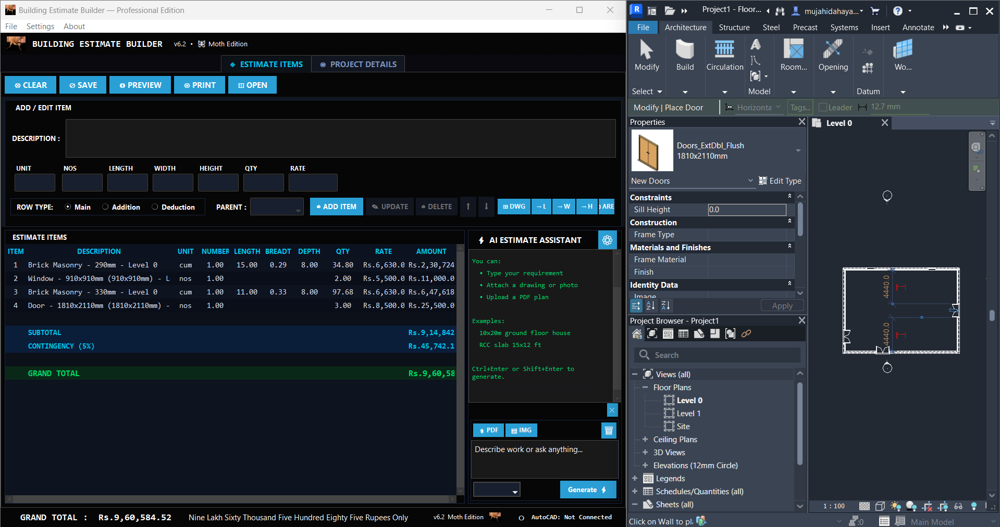
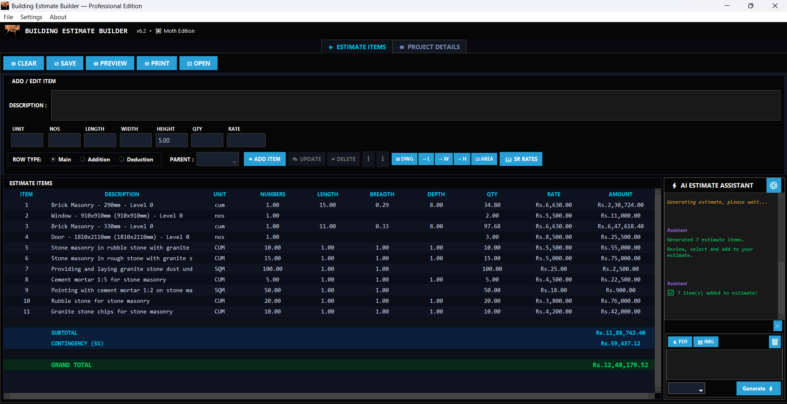
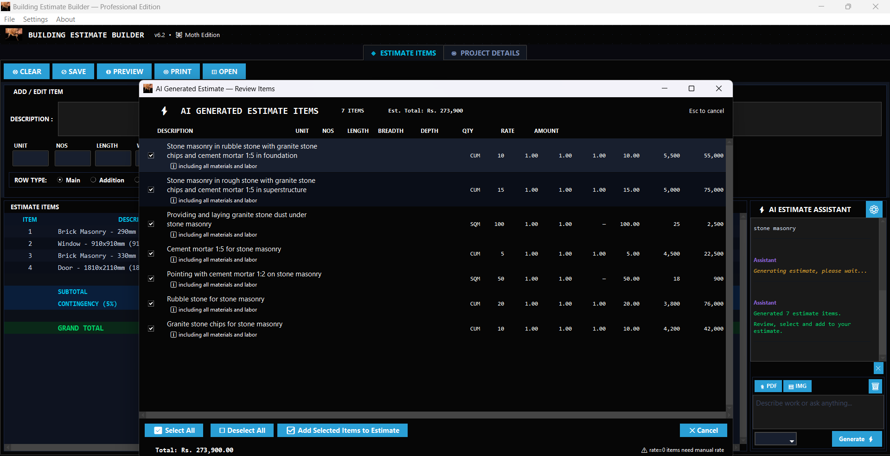
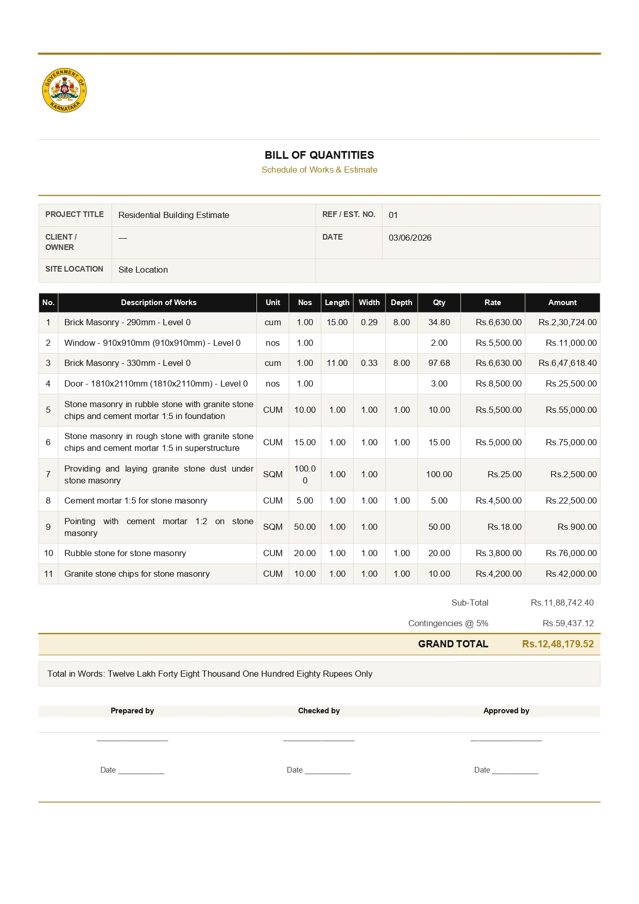
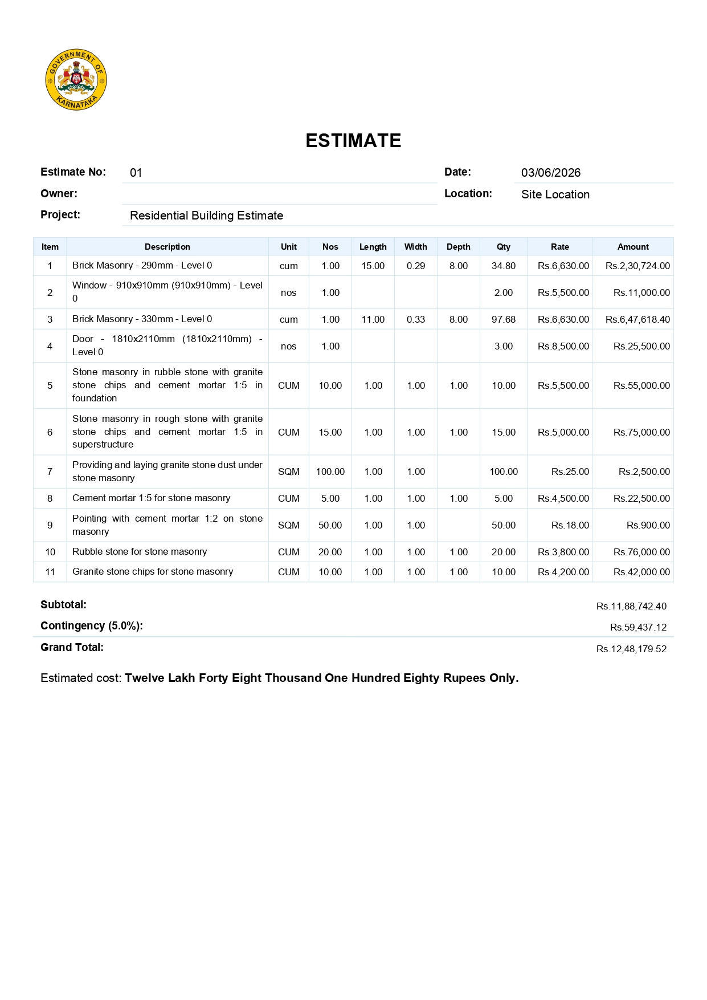
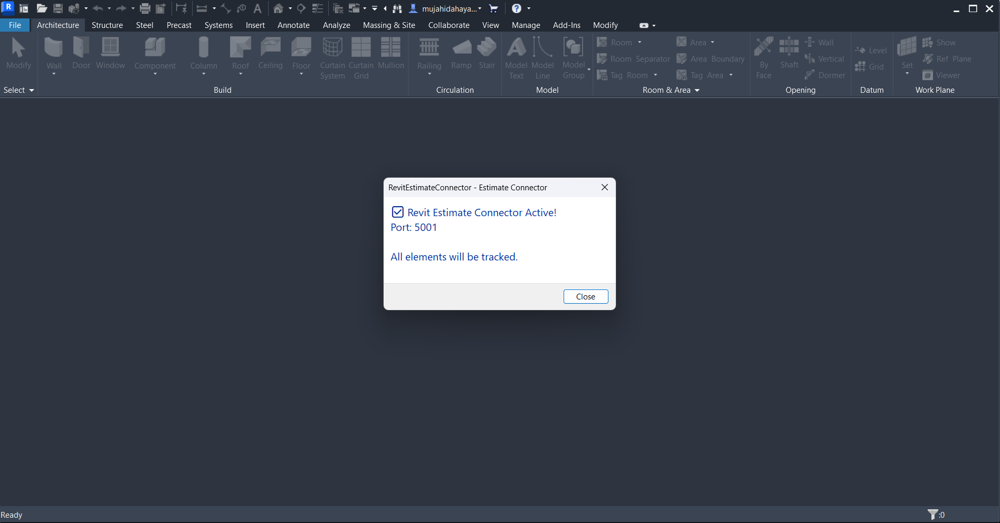
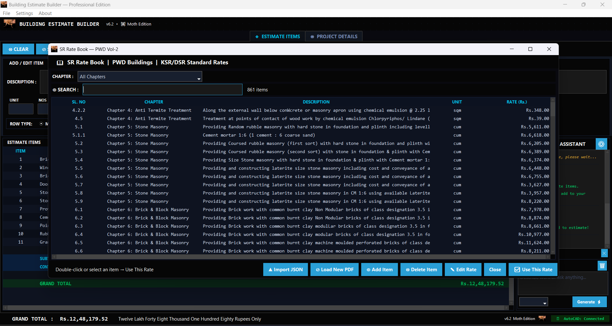
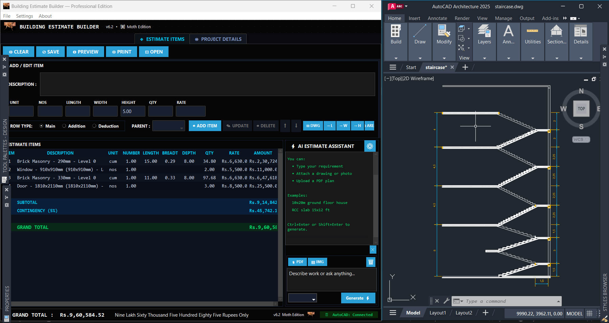
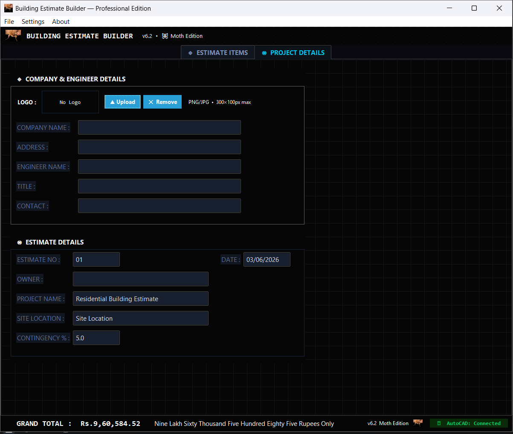

<div align="center">



# Building Estimate Builder
### Professional Desktop Application · Python · v6.4

**A full-stack computational design tool built for the AEC industry —  
combining parametric automation, AI, BIM integration, and professional PDF generation**

[](https://www.python.org/)
[](https://www.rhino3d.com/6/new/grasshopper/)
[](https://www.autodesk.com/products/revit/)
[](https://www.autodesk.com/products/autocad/)
[](https://groq.com/)
[](LICENSE)

[Overview](#-overview) · [Features](#-features) · [BIM Integration](#-bim-integration) · [Screenshots](#-screenshots) · [Installation](#-installation) · [API Reference](#-api-reference) · [Technologies](#-technologies)

</div>

---

## 📌 Overview

Building Estimate Builder is a **full-stack AEC desktop application** that automates construction quantity take-offs and cost estimation. It demonstrates end-to-end software development for the built environment — from live BIM data pipelines (Revit, AutoCAD) to AI-powered generation and multi-template professional PDF output.

Built entirely in Python, it showcases:
- **Custom API development** for AEC software interoperability (Revit, AutoCAD, Grasshopper)
- **AI/ML integration** for automated estimate generation from text, PDFs, and images
- **Parametric data structures** for quantity computation (volume, area, linear, count)
- **Full-stack Python** — GUI, REST server, PDF engine, PDF parser, COM automation

> *Relevant to roles in Computational Design, BIM Development, and AEC Software Engineering*

---

## ✨ Features

### 🔢 Parametric Quantity Engine
- Add / edit / delete / reorder estimate line items
- **Main + Addition + Deduction** row types with net quantity computation
- Auto quantity calculation from dimensions: `Nos × L × W × H` → Volume / Area / Linear / Count
- Sub-total, contingency %, grand total — amount in words (INR)
- Save / open estimates in structured **JSON format**

### 📄 PDF Export — 4 Professional Templates
| Template | Style | Accent Color |
|----------|-------|--------------|
| **Classic** | Original clean estimate layout | Light blue |
| **Minimal** | Pure B&W, maximum whitespace | None |
| **Professional A** | Formal BOQ letterhead + signature block | Gold |
| **Bid Format** | Construction bid sheet with section headers | Steel blue |

All templates include company logo, engineer details, project info, amount in words, and signature blocks.

### 🤖 AI Estimate Generation
- Powered by **Groq API** — Llama 3.3 70B (free tier)
- Generate complete estimates from natural language: *"10×12m RCC slab with columns"*
- Attach **PDF drawings** or **photos/images** → Vision model extracts quantities
- Preview generated items with checkboxes before adding
- Prompt history and multi-turn conversation memory

### 📐 AutoCAD Live Integration
- COM bridge via **pywin32** to live AutoCAD session
- Pick **Length**, **Width**, **Height** directly from drawing objects
- Pick **Area** from closed polylines / regions
- Real-time dimension extraction into form fields

### 🏗️ Revit / Dynamo Live Sync
- Built-in **Flask REST server** on `http://127.0.0.1:5001`
- Push items from Revit Dynamo scripts directly into the estimate
- Live update — items appear instantly without restart
- Designed as a foundation for **Grasshopper ↔ Rhino.Compute** pipeline

### 📖 KSR / DSR Rate Book Engine
- Load **PWD Vol-2 / KSR standard rates** from PDF (auto-parsed with pdfplumber)
- Chapter-wise filtering + full-text search across 1000+ items
- Add, edit, delete rate items — persisted in JSON
- One-click **"Use This Rate"** → fills estimate form

### 🎨 UI / UX
- Dark blueprint grid theme — purpose-built for AEC professionals
- Multi-tab interface: Estimate Items + Project Details
- Keyboard navigation, color-coded row types, status bar with live total

---

## 🔌 BIM Integration

### Revit / Dynamo → Estimate (REST API)

The built-in Flask server accepts POST requests from any BIM tool:

```python
# Dynamo Python node example
import requests, json

item = {
    "description": "RCC Column M25 1:1.5:3",
    "unit": "cum",
    "numbers": 8,
    "length": 0.45,
    "breadth": 0.45,
    "depth": 3.5,
    "quantity": 5.67,
    "rate": 9500
}

response = requests.post(
    "http://127.0.0.1:5001/revit/add-item",
    json=item
)
print(response.json())  # {"status": "ok", "item": 5}
```

### AutoCAD COM Bridge

```python
# Pick length directly from AutoCAD drawing object
acad = Autocad(create_if_not_exists=False, visible=True)
selection = acad.get_selection("Select object for Length:")
length = selection.Item(0).Length  # → auto-filled into form
```

### Grasshopper Integration *(in development)*

Architecture for **Grasshopper ↔ Rhino.Compute** bidirectional sync:
- Grasshopper sends parametric quantities → estimate updates live
- Estimate data feeds back into Grasshopper as parameters
- Uses same Flask REST pattern as Revit server

---

## 📸 Screenshots

| Main Estimate View | AI Assistant Panel |
|---|---|
|  |  |

| PDF — Professional A (Gold) | PDF — Bid Format (Steel Blue) |
|---|---|
|  |  |

| AutoCAD — Revit (add-ins) | KSR Rate Book |
|---|---|
|  |  |
|  |  |

---

## 🚀 Installation

### Prerequisites

| Requirement | Version |
|-------------|---------|
| Python | 3.8+ |
| OS | Windows 10/11 |
| Git | Latest |

### Clone & Install

```bash
git clone https://github.com/lessdegree-droid/BuildingEstimateBuilder.git
cd BuildingEstimateBuilder
pip install -r requirements.txt
```

### Run

```bash
python BuildingEstimateBuilder_v64_Final.py
```

### AI Features (Optional — Free)

1. Get a free API key at [console.groq.com](https://console.groq.com)
2. In app: **Settings → AI Settings** → paste key (starts with `gsk_`) → Save

---

## 📦 Requirements

```
reportlab
pdfplumber
ttkbootstrap
Pillow
requests
flask
pywin32
pyautocad
```

> `pywin32` + `pyautocad` are Windows-only (AutoCAD COM). App runs without them — AutoCAD features disable gracefully.

---

## 🗂️ Project Structure

```
BuildingEstimateBuilder/
│
├── BuildingEstimateBuilder_v64_Final.py   # Full application (~4000 lines)
│   ├── BuildingEstimator class            # Main app controller
│   ├── _save_pdf_classic/minimal/proa/bid # 4 PDF template engines
│   ├── _build_rows()                      # Shared parametric row builder
│   ├── _start_revit_server()              # Flask REST server (BIM bridge)
│   ├── _ai_get_items()                    # Groq API integration
│   ├── open_autocad_file()                # AutoCAD COM bridge
│   └── _parse_ksr_pdf()                   # KSR rate book PDF parser
│
├── ksr_rates.json                          # Rate book data (optional)
├── requirements.txt
├── README.md
└── screenshots/
```

---

## 🛠️ Technologies

| Technology | Role in Project |
|------------|----------------|
| **Python 3.8+** | Core language — all logic, GUI, server, PDF |
| **Tkinter + ttkbootstrap** | Desktop GUI framework |
| **ReportLab** | Programmatic PDF generation (4 templates) |
| **pdfplumber** | PDF parsing — KSR rate book extraction |
| **Flask** | Embedded REST server for BIM interoperability |
| **Groq API (Llama 3.3 70B)** | AI estimate generation + vision model |
| **pywin32 (COM)** | AutoCAD live integration via Windows COM |
| **pyautocad** | AutoCAD object interaction |
| **Pillow (PIL)** | Image handling, logo embedding |
| **JSON** | Structured estimate save/load |

---

## 🔧 API Reference

### Revit / BIM Server

**Base URL:** `http://127.0.0.1:5001`

| Endpoint | Method | Description |
|----------|--------|-------------|
| `/revit/add-item` | `POST` | Push estimate item from any BIM tool |

**Request body:**
```json
{
  "description": "RCC Slab M20 1:1.5:3",
  "unit": "cum",
  "numbers": 1,
  "length": 10.0,
  "breadth": 8.0,
  "depth": 0.15,
  "quantity": 12.0,
  "rate": 7500
}
```

**Response:**
```json
{ "status": "ok", "item": 3 }
```

---

## 🗺️ Roadmap

- [x] Revit / Dynamo live sync (REST API)
- [x] AutoCAD COM dimension picking
- [x] AI estimate generation (text + image + PDF)
- [x] 4 professional PDF templates
- [x] KSR / DSR rate book with PDF parsing
- [ ] **Grasshopper ↔ Rhino.Compute** bidirectional pipeline
- [ ] Custom Grasshopper node (GH plugin)
- [ ] IFC / BIM data extraction
- [ ] Excel export (openpyxl)
- [ ] Cloud sync / Google Drive
- [ ] Web version (FastAPI + React)

---

## 👤 Author

<div align="center">

**Mujahid Hayatkhan**  
*Architect & Computational Designer*

[](https://linkedin.com/in/mujahid-h1)
[](https://github.com/lessdegree-droid)

*Building at the intersection of architecture, computation, and software —  
passionate about deploying real-world AEC tools that work.*

</div>

---

## 📄 License

MIT License — see [LICENSE](LICENSE) for details.

---

<div align="center">

*If this project was useful, please ⭐ star the repository!*

</div>
